  <strong>Language:</strong>
  <a href="./README.md">繁體中文</a>
  |
  English (current)

<!-- NOTE: the Experience / Education entries below are draft placeholders — verify before relying on them. -->

  

  <h3>AI Generation Platform Engineer • Full Stack • ComfyUI / Plugin Ecosystem • XR</h3>
  <h4>Taking generative AI from research prototype to a deliverable, maintainable, commercial product system</h4>

  <a href="#profile">Profile</a> ·
  <a href="#value">Expertise</a> ·
  <a href="#achievements">Achievements</a> ·
  <a href="#experience">Experience</a> ·
  <a href="#projects">Projects</a> ·
  <a href="#stack">Stack</a> ·
  <a href="#fit">Roles</a>

## Short Profile

My work sits at the intersection of **generative AI platforms**, **plugin ecosystem architecture**, and **healthcare deployment**: packaging generation engines such as ComfyUI into products that non-technical staff can operate directly, completing the productization requirements around them — permissions, auditing, queueing, deployment — and running them in real institutions.

- **Full technical chain:** ComfyUI custom nodes → generation queue and multi-worker scheduling → Django / React console → SSO / RBAC / audit → NAS and Cloudflare deployment.
- **Two product lines in parallel:** NMGenAI (next-generation platform, media generation at the core with care features modularized) and NMRehab (a live dementia-rehabilitation AI control system under continuous maintenance).
- **Plugins as products:** the architecture targets customers installing plugins from a package center to extend the system without recompiling; each plugin ships its own backend and frontend and moves across systems.
- **Security first (SSDLC):** every change begins with an assessment of XSS / injection / access control / PII risk, tracked end to end through Redmine issues, PR review, version tags, and release notes.

**Email:** neurmostudio@gmail.com　**Site:** [www.neurmo.co](https://www.neurmo.co/)　**GitHub:** [@neurmostudio0409](https://github.com/neurmostudio0409)　**Location:** Taiwan (remote-friendly)

## Expertise

- Productize generative AI workflows (ComfyUI / LLM / TTS / lipsync) into multi-tenant platforms with accounts, quotas, and audit trails;
- Design Django / FastAPI backend architecture: task queues, multi-worker concurrency, service-to-service token authorization, RBAC, and audit chains;
- Design commercially viable plugin architecture: manifest specification, self-contained frontend and backend, host-token theming, installation without recompilation;
- Develop ComfyUI custom nodes and integrate third-party generation APIs (Veo, Grok, Replicate, voai, and others);
- Take over and stabilize legacy systems: containerization, migration backfill, security remediation, and CI/CD adoption;
- Unity XR/VR application development and 3D asset tooling;
- Localized speech research, including Taiwanese Hokkien TTS training and evaluation.

## Key Achievements

### Generative AI Platform (NMGenAI)

- Built a **Django + React generation platform**: a unified `/console` back office (accounts and roles, generation history, package center), with media generation at the core and care features delivered as toggleable plugins.
- Implemented an **MCP Server** (`POST /mcp/`) for direct LLM and agent integration: capability discovery, generation submission, pipeline status tracking, and asset retrieval.
- Enforced **RBAC flags and data scopes** across every consumer: administrator scope pinned to cross-account visibility, regular accounts strictly limited to their own resources.
- Evolved the generation queue into a **multi-worker concurrent** architecture, resolving race conditions caused by non-atomic DB polling.
- Introduced Keycloak SSO discovery with fail-closed encryption, replacing an earlier host-based heuristic.

### Plugin Ecosystem / Package Center

- Defined a full-stack self-contained plugin contract: Python backend and JS frontend delivered as one package, `@plugins` alias integrated into the build, styling driven solely by host CSS tokens.
- Completed a ComfyUI plugin frontend-embedding pilot and mapped the licensing boundary between litegraph (MIT) and the ComfyUI frontend (GPL).
- Target shape: **plugins as downloadable products** — sell the base system, let customers extend it from the package center.

### ComfyUI Custom Nodes

- [ComfyUI-Veo-NM](https://github.com/neurmostudio0409/ComfyUI-Veo-NM), [ComfyUI-Grok-NM](https://github.com/neurmostudio0409/ComfyUI-Grok-NM), [ComfyUI-ATEN-NM](https://github.com/neurmostudio0409/ComfyUI-ATEN-NM), [ComfyUI-Muse-NM](https://github.com/neurmostudio0409/ComfyUI-Muse-NM), [ComfyUI-voai-NM](https://github.com/neurmostudio0409/ComfyUI-voai-NM), [ComfyUI-replicate-api-NM](https://github.com/neurmostudio0409/ComfyUI-replicate-api-NM), [ComfyUI-replicate-Lipsync-api-NM](https://github.com/neurmostudio0409/ComfyUI-replicate-Lipsync-api-NM).

### Healthcare Deployment (NMRehab)

- An AI rehabilitation control system for dementia patients (FastAPI + MySQL + ComfyUI), live in a care institution and under continuous maintenance.
- SSDLC hardening: login lockout, password policy and history, audit-log integrity (hash chain), dynamic RBAC, and owner-isolated generation resources.
- Introduced three-tier configuration (`.env` / `config_items` / `system_config`) to replace a single config.json, backed by 44+ reversible migrations.
- Delivered Dockerized NAS deployment behind a Cloudflare reverse proxy, systematically auditing legacy technical debt and executing minimally invasive stabilization.

### XR / Speech / Developer Tooling

- Unity VR applications and 3D asset tooling (VRJump series, Flac3DXR).
- Taiwanese Hokkien TTS research: VibeVoice and Coqui-TTS localization training.
- Developer tooling and infrastructure: soplint static analysis, and a self-hosted Redmine + GitLab + NAS engineering environment.

## Experience

### NeurmoAI (智願科技)

**Founder / Principal Engineer**
**2023 - Present**

- Led NMGenAI from the ground up: Django + React architecture, plugin marketplace, MCP Server, SSO and RBAC.
- Owned www.neurmo.co and its CMS routing architecture — the public site carries no compute load and routes to the generation backend.
- Drove generative AI workflows into healthcare settings, covering security auditing and production operations.
- Stack: Python, Django, React/TypeScript, ComfyUI, Keycloak, PostgreSQL, Docker.

### Mennonite Dementia Rehabilitation AI Pilot Program

**Technical Lead**
**2025 - Present**

- Development and long-term maintenance of the NMRehab control system (FastAPI + MySQL + ComfyUI), live in a care institution.
- SSDLC hardening: login lockout, password policy and history, audit hash chain, dynamic RBAC, owner-isolated generation resources.
- Built the GitLab CI deployment chain (QC / Staging / Production) and 44+ reversible migrations.

### VRJump / XR Projects

**Unity / XR Engineer**
**2022 - Present**

- VR interactive application development, 3D asset pipelines, and Unity tooling.
- Stack: Unity, C#, WebXR, Blender.

### Earlier Roles

**2018 - 2022**

- Web and systems development: maintenance and modernization of legacy PHP/HTML sites.
- Self-hosted infrastructure: building and operating an internal Redmine + GitLab + NAS environment.

**Education:** <!-- TODO: school / major / years -->

## Selected Projects

| Project | What it delivers | Technologies |
| --- | --- | --- |
| **NMGenAI** | Multi-tenant AI generation platform, plugin marketplace, MCP Server, RBAC and audit | Django, React, TypeScript, ComfyUI, Keycloak, PostgreSQL |
| **NMRehab** | Long-term maintenance and security hardening of a live medical application | FastAPI, MySQL, ComfyUI, Docker |
| [www.neurmo.co](https://www.neurmo.co/) | Corporate site and CMS routing architecture (zero compute on the front end, routed to the generation backend) | Next.js, Payload CMS, PostgreSQL, i18n |
| [ComfyUI-Veo-NM](https://github.com/neurmostudio0409/ComfyUI-Veo-NM) | Third-party generation APIs integrated as nodes | Python, ComfyUI |
| [ComfyUI-replicate-Lipsync-api-NM](https://github.com/neurmostudio0409/ComfyUI-replicate-Lipsync-api-NM) | Lipsync generation pipeline integration | Python, Replicate API |
| **Taigi TTS** | Taiwanese Hokkien speech synthesis training and evaluation | Python, PyTorch |

## Technology Stack

**Backend:** Python, Django, FastAPI, DRF, task queues, PostgreSQL, MySQL, SQLite
**Frontend:** TypeScript, React, Vite, vanilla JS, CSS token systems, Next.js
**AI / Generation:** ComfyUI (custom nodes, workflow API), LLM / MCP, TTS (Coqui, VibeVoice), lipsync, Replicate / Veo / Grok APIs
**Infrastructure:** Docker, self-hosted NAS, Cloudflare, GitLab CI, systemd, nginx
**Security:** RBAC, SSO (Keycloak/OIDC), audit hash chains, CSP, SSDLC, OWASP ZAP / SonarQube
**XR:** Unity, C#, VR/XR interaction and asset pipelines
**Process:** Redmine + GitLab/GitHub, issue-per-branch, PR review, version tags and release notes

## Best-Fit Roles

- **AI Platform Engineering** — productizing generation engines: queue scheduling, quota control, back office, plugin marketplace.
- **Full Stack Engineering (Python + React)** — internal platforms, admin consoles, system integration, deployment operations.
- **ComfyUI / Workflow Engineering** — custom node development, API node wrappers, frontend node UI porting.
- **Legacy Takeover and Stabilization** — security remediation, containerization, migration governance, CI/CD adoption.
- **Healthcare Deployment** — projects that must reach the institution floor and stay maintained there.

  
  

> 2026 · NeurmoAI
