  <strong>語言：</strong>
  繁體中文（目前）
  |
  <a href="./README.en.md">English</a>

<!-- 注意：以下「經歷／學歷」為暫定草稿內容，正式發佈前請自行核對修正 -->

  

  <h3>AI 生成平台工程師 • 全端 • ComfyUI／外掛生態 • XR</h3>
  <h4>將生成式 AI 從研究原型推進為可交付、可維運、可商業化的產品系統</h4>

  <a href="#profile">簡介</a> ·
  <a href="#value">專業能力</a> ·
  <a href="#achievements">主要成果</a> ·
  <a href="#experience">經歷</a> ·
  <a href="#projects">代表專案</a> ·
  <a href="#stack">技術棧</a> ·
  <a href="#fit">合作方向</a>

---

## 簡介

我的專業落在 **生成式 AI 平台**、**外掛生態架構** 與 **醫療照護場域落地** 三者的交界：將 ComfyUI 等生成引擎封裝為非技術使用者可直接操作的產品，補齊權限、稽核、佇列與部署等產品化要件，並實際導入機構現場長期營運。

- **涵蓋完整技術鏈路**：ComfyUI 自訂節點 → 生成佇列與多 worker 排程 → Django／React 管理後台 → SSO／RBAC／稽核 → NAS 與 Cloudflare 部署維運。
- **同時維持兩條產品線**：NMGenAI（新一代平台，以媒體生成為核心、照護功能模組化）與 NMRehab（已上線之失智復健 AI 中控系統，持續維運）。
- **外掛即商品**：架構目標為客戶自套件中心安裝外掛即可擴充功能，無須重新編譯；外掛自帶前後端、可跨系統搬移。
- **資安優先（SSDLC）**：每項變更先評估 XSS／注入／存取控制／PII 風險，並以 Redmine issue、PR review、版本 tag 與 release notes 全程留痕。

**信箱：** neurmostudio@gmail.com　**網站：** [neurmo.co](https://neurmo.co)　**GitHub：** [@neurmostudio0409](https://github.com/neurmostudio0409)　**地點：** 台灣（可遠端）

---

## 專業能力

- 將生成式 AI 工作流（ComfyUI／LLM／TTS／Lipsync）產品化為具帳號、配額與稽核機制的多租戶平台；
- 設計 Django／FastAPI 後端架構：任務佇列、多 worker 並發、服務間 token 授權、RBAC 與稽核鏈；
- 設計可商業化的外掛架構：manifest 規格、前後端自包含、樣式由宿主 token 覆寫、免重新編譯安裝；
- 開發 ComfyUI 自訂節點並整合第三方生成 API（Veo、Grok、Replicate、voai 等）；
- 接手並穩定化 legacy 系統：容器化、migration 補齊、資安缺口修補與 CI/CD 導入；
- Unity XR／VR 應用開發與 3D 資產工具鏈；
- 在地化語音技術研究，包含台語 TTS 訓練與評估。

---

## 主要成果

### 生成式 AI 平台（NMGenAI）

- 建置 **Django + React 生成平台**：`/console` 統一管理後台（帳號角色、生成歷程、套件中心），以媒體生成為核心，照護功能以可開關外掛形式交付。
- 實作 **MCP Server**（`POST /mcp/`），供 LLM 與 agent 直接介接：能力查詢、生成任務提交、pipeline 狀態追蹤與素材取得。
- 將 **RBAC 旗標與資料域** 落實至所有消費端：管理者 scope 釘死跨帳號視野，一般帳號嚴格限縮於自有資源。
- 生成佇列演進至 **多 worker 並發** 架構，解決 DB 輪詢非原子操作導致的競態問題。
- 導入 Keycloak SSO discovery 與加密 fail-closed 機制，取代早期以 host 判斷的啟發式作法。

### 外掛生態 / 套件中心

- 制定外掛全端自包含契約：後端 Python 與前端 JS 同包交付，`@plugins` 別名納入建置流程，樣式僅依宿主 CSS token。
- 完成 ComfyUI 外掛前端嵌入試點，並釐清 litegraph（MIT）與 ComfyUI 前端（GPL）之授權邊界。
- 目標形態為 **外掛即可下載商品**：銷售 base 系統，由客戶自套件中心擴充所需功能。

### ComfyUI 自訂節點

- [ComfyUI-Veo-NM](https://github.com/neurmostudio0409/ComfyUI-Veo-NM)、[ComfyUI-Grok-NM](https://github.com/neurmostudio0409/ComfyUI-Grok-NM)、[ComfyUI-ATEN-NM](https://github.com/neurmostudio0409/ComfyUI-ATEN-NM)、[ComfyUI-Muse-NM](https://github.com/neurmostudio0409/ComfyUI-Muse-NM)、[ComfyUI-voai-NM](https://github.com/neurmostudio0409/ComfyUI-voai-NM)、[ComfyUI-replicate-api-NM](https://github.com/neurmostudio0409/ComfyUI-replicate-api-NM)、[ComfyUI-replicate-Lipsync-api-NM](https://github.com/neurmostudio0409/ComfyUI-replicate-Lipsync-api-NM)。

### 醫療照護場域落地（NMRehab）

- 為失智症患者設計之 AI 復健中控系統（FastAPI + MySQL + ComfyUI），已於機構實際上線並持續維運。
- SSDLC 強化：登入鎖定、密碼政策與歷史、稽核日誌完整性（hash chain）、動態 RBAC、生成資源依擁有者隔離。
- 導入三層配置分層（`.env` / `config_items` / `system_config`）取代單一 config.json，並建立 44 支以上可回滾 migration。
- 完成 NAS Docker 化部署（Cloudflare 反向代理），系統性盤點 legacy 技術債並執行最小侵入式穩定化。

### XR / 語音 / 開發者工具

- Unity VR 應用與 3D 資產工具鏈（VRJump 系列、Flac3DXR）。
- 台語 TTS 研究：VibeVoice 與 Coqui-TTS 在地化訓練。
- 開發者工具與研發基礎設施：soplint 靜態檢查工具，以及自架 Redmine + GitLab + NAS 研發環境。

---

## 經歷

### Neurmo Studio（紐墨工作室）

**創辦人 / 首席工程師**
**2023 - 現在**

- 主導 NMGenAI 生成平台自零建置：Django + React 架構、外掛市集、MCP Server、SSO 與 RBAC。
- 負責 neurmo.co 官網與 CMS 導流架構設計（官網不負擔算力，統一導向生成後端）。
- 推動生成式 AI 工作流導入醫療照護場域，涵蓋資安稽核與正式環境維運。
- 技術棧：Python, Django, React/TypeScript, ComfyUI, Keycloak, PostgreSQL, Docker。

### 門諾 — 失智復健 AI 應用實證計畫

**技術負責人**
**2025 - 現在**

- NMRehab 中控系統（FastAPI + MySQL + ComfyUI）開發與長期維運，系統已於機構實際上線。
- SSDLC 強化：登入鎖定、密碼政策與歷史、稽核 hash chain、動態 RBAC、生成資源擁有者隔離。
- 建立 GitLab CI 部署鏈（QC / Staging / Production）與 44 支以上可回滾 migration。

### VRJump / XR 專案

**Unity / XR 工程師**
**2022 - 現在**

- VR 互動應用開發、3D 資產管線建置與 Unity 工具開發。
- 技術棧：Unity, C#, WebXR, Blender。

### 更早的經歷

**2018 - 2022**

- 網站與系統開發：legacy PHP／HTML 站台維運與現代化重寫。
- 基礎設施自建：內部 Redmine + GitLab + NAS 研發環境建置與維運。

**學歷：** <!-- 待補：學校 / 科系 / 年份 -->

---

## 代表專案

| 專案 | 專案價值 | 技術 |
| --- | --- | --- |
| **NMGenAI** | 多租戶 AI 生成平台、外掛市集、MCP Server、RBAC 與稽核 | Django, React, TypeScript, ComfyUI, Keycloak, PostgreSQL |
| **NMRehab** | 已上線醫療應用之長期維運與資安強化 | FastAPI, MySQL, ComfyUI, Docker |
| **neurmo.co** | 企業官網與 CMS 導流架構（前台零算力負擔，導向生成後端） | Next.js, Payload CMS, PostgreSQL, i18n |
| [ComfyUI-Veo-NM](https://github.com/neurmostudio0409/ComfyUI-Veo-NM) | 第三方生成 API 節點化整合 | Python, ComfyUI |
| [ComfyUI-replicate-Lipsync-api-NM](https://github.com/neurmostudio0409/ComfyUI-replicate-Lipsync-api-NM) | 口型同步生成管線整合 | Python, Replicate API |
| **Taigi TTS** | 台語語音合成在地化訓練與評估 | Python, PyTorch |

---

## 技術棧

**後端：** Python, Django, FastAPI, DRF, 任務佇列, PostgreSQL, MySQL, SQLite
**前端：** TypeScript, React, Vite, Vanilla JS, CSS token 系統, Next.js
**AI／生成：** ComfyUI（自訂節點／workflow API）, LLM / MCP, TTS（Coqui, VibeVoice）, Lipsync, Replicate / Veo / Grok API
**基礎設施：** Docker, NAS 自建, Cloudflare, GitLab CI, systemd, nginx
**資安：** RBAC, SSO (Keycloak/OIDC), 稽核 hash chain, CSP, SSDLC, OWASP ZAP / SonarQube
**XR：** Unity, C#, VR/XR 互動與資產管線
**流程：** Redmine + GitLab/GitHub、issue 對應分支、PR review、版本 tag 與 release notes

---

## 合作方向

- **AI 生成平台工程** — 將生成引擎產品化：佇列排程、配額控管、管理後台、外掛市集。
- **全端工程（Python + React）** — 內部平台、管理後台、系統整合與部署維運。
- **ComfyUI／工作流工程** — 自訂節點開發、API 節點化、前端節點 UI 移植。
- **Legacy 系統接手與穩定化** — 資安缺口修補、容器化、migration 治理與 CI/CD 導入。
- **醫療照護場域落地** — 需要實際導入機構現場並長期維運的專案。

---

  
  

> 2026 · NeurmoAI
