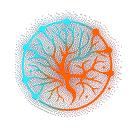

<!-- 注意：以下「經歷／學歷」為暫定草稿內容，正式發佈前請自行核對修正 -->

  
  <h2>
    Hi，我是 NeurmoAI 
    AI 生成平台工程師 • 全端 • ComfyUI／外掛生態 • XR
  </h2>
  <h4>把 AI 生成從「跑得動的 demo」做成「賣得出去、維運得起來的產品」</h4>
  <b>Python</b> • Django • React／TypeScript • FastAPI • ComfyUI • Unity XR • Docker

  <a href="#profile">簡介</a> ·
  <a href="#value">能提供什麼</a> ·
  <a href="#achievements">主要成果</a> ·
  <a href="#experience">經歷</a> ·
  <a href="#projects">代表專案</a> ·
  <a href="#stack">技術棧</a> ·
  <a href="#fit">合作方向</a>

---

## 簡介

我做的事情落在 **AI 生成平台**、**外掛生態**、**醫療／照護落地應用** 三者的交界：把 ComfyUI 這類生成引擎包成可以給非技術使用者操作的產品，做權限、稽核、佇列、部署，然後真的推到機構現場用。

- **從引擎到產品的完整鏈路**：ComfyUI 自訂節點 → 生成佇列／多 worker → Django/React 後台 → SSO／RBAC／稽核 → NAS/Cloudflare 部署。
- **兩條產品線並行**：NMGenAI（新平台，媒體生成為主 + 照護外掛）與 NMRehab Legacy（已上市的失智復健 AI 中控系統，持續維運）。
- **外掛即商品**：目標是客戶從套件中心安裝外掛就能擴充，不必 rebuild — 外掛自帶前後端、跨系統可搬移。
- **SSDLC 優先**：每個改動先看 XSS／注入／存取控制／PII，配 Redmine issue、PR review、版本 tag 與 release notes。

**信箱：** neurmostudio@gmail.com　**網站：** [neurmo.co](https://neurmo.co)　**GitHub：** [@neurmostudio0409](https://github.com/neurmostudio0409)　**地點：** 台灣（可遠端）

---

## 能提供什麼

- 把生成式 AI 工作流（ComfyUI／LLM／TTS／Lipsync）包成有帳號、有配額、有稽核的多租戶平台；
- 設計 Django / FastAPI 後端：任務佇列、多 worker 並發、S2S token 授權、RBAC 與稽核鏈；
- 寫可販售的外掛架構：manifest、前後端自包含、宿主 token 覆寫樣式、免 rebuild 安裝；
- 開發 ComfyUI 自訂節點並接第三方生成 API（Veo／Grok／Replicate／voai …）；
- 接手並穩定化 legacy 系統：容器化、migration 補齊、資安補洞、CI/CD 上線；
- Unity XR／VR 應用與資產工具鏈；
- 台語 TTS 等在地化語音研究與訓練。

---

## 主要成果

### AI 生成平台（NMGenAI）

- 建置 **Django + React 生成平台**：/console 統一後台（帳號角色、生成歷程、套件中心），媒體生成為主、照護功能做成可開關外掛。
- 實作 **MCP Server**（`POST /mcp/`）供 LLM／agent 直接呼叫：能力列表、送生成任務、查 pipeline 狀態、取素材。
- **RBAC 旗標與資料域**落地到所有消費端，admin scope 釘死跨帳號、一般帳號嚴格 own scope。
- 生成佇列往**多 worker 並發**演進，處理 DB 輪詢非原子造成的 race。
- SSO（Keycloak）discovery、加密 fail-closed，取代早期以 host 判斷的啟發式作法。

### 外掛生態 / 套件中心

- 外掛全端自包含契約：後端 Python + 前端 JS 同包，`@plugins` 別名進 build，樣式只吃宿主 CSS token。
- ComfyUI 外掛試點打通前端嵌入（litegraph MIT／ComfyUI 前端 GPL 的授權邊界已釐清）。
- 目標形態：**外掛＝可下載商品**，賣 base 系統，客戶自行從套件中心安裝擴充。

### ComfyUI 自訂節點

- [ComfyUI-Veo-NM](https://github.com/neurmostudio0409/ComfyUI-Veo-NM)、[ComfyUI-Grok-NM](https://github.com/neurmostudio0409/ComfyUI-Grok-NM)、[ComfyUI-ATEN-NM](https://github.com/neurmostudio0409/ComfyUI-ATEN-NM)、[ComfyUI-Muse-NM](https://github.com/neurmostudio0409/ComfyUI-Muse-NM)、[ComfyUI-voai-NM](https://github.com/neurmostudio0409/ComfyUI-voai-NM)、[ComfyUI-replicate-api-NM](https://github.com/neurmostudio0409/ComfyUI-replicate-api-NM)、[ComfyUI-replicate-Lipsync-api-NM](https://github.com/neurmostudio0409/ComfyUI-replicate-Lipsync-api-NM)。
- [Yusu-WhatDreamsCost-ComfyUI](https://github.com/neurmostudio0409/Yusu-WhatDreamsCost-ComfyUI)：LTX Director 時間軸強化 — 轉場控制、音／圖／影排列、時長編輯、媒體同步與裁切。

### 醫療／照護落地（NMRehab）

- 為失智症患者設計的 AI 復健中控系統（FastAPI + MySQL + ComfyUI），已上市並持續維運。
- SSDLC 強化：登入鎖定、密碼政策／歷史、稽核日誌完整性（hash chain）、動態 RBAC、生成資源按擁有者隔離。
- 三層配置分層（`.env` / `config_items` / `system_config`）取代單一 config.json，配 44+ 支可回滾 migration。
- NAS Docker 化部署（Cloudflare → 反向代理），把 legacy 的系統性技術債攤開並做最小穩定化。

### XR / 語音 / 工具

- Unity VR 專案與資產工具鏈（VRJump 系列、Flac3DXR）。
- 台語 TTS 研究：VibeVoice / Coqui-TTS 在地化訓練。
- 開發者工具：[ponytail](https://github.com/neurmostudio0409/ponytail)（讓 AI agent 用最懶但正確的解法）、soplint、Redmine + GitLab 自架 NAS 環境。

---

## 經歷

### Neurmo Studio（紐墨工作室）

**創辦人 / 首席工程師**
**2023 - 現在**

- 主導 NMGenAI 生成平台從 0 到 1：Django + React 架構、外掛市集、MCP Server、SSO 與 RBAC。
- 負責 neurmo.co 官網與 CMS 導流架構（官網不吃算力，導向 GPU 端生成）。
- 帶 AI 生成工作流落地到醫療照護場域，含資安稽核與部署維運。
- 技術棧：Python, Django, React/TypeScript, ComfyUI, Keycloak, PostgreSQL, Docker。

### 門諾 - 失智復健 AI 應用實證計畫

**技術負責人**
**2025 - 現在**

- NMRehab 中控系統（FastAPI + MySQL + ComfyUI）開發與長期維運，系統已於機構實際上線。
- SSDLC 強化：登入鎖定、密碼政策／歷史、稽核 hash chain、動態 RBAC、生成資源擁有者隔離。
- 建立 GitLab CI 部署鏈（QC / Staging / Production）與 44+ 支可回滾 migration。

### VRJump / XR 專案

**Unity / XR 工程師**
**2022 - 現在**

- VR 互動應用、3D 資產管線與 Unity 工具開發。
- 技術棧：Unity, C#, WebXR, Blender。

### 更早的經歷

**2018 - 2022**

- 網站與系統開發：PHP / HTML 舊站維護與現代化重寫（jeelong-website、netyea-php8）。
- 自架基礎設施：Redmine + GitLab + NAS 的內部研發環境建置與維運。

**學歷：** <!-- 待補：學校 / 科系 / 年份 -->

---

## 代表專案

| 專案 | 證明了什麼 | 技術 |
| --- | --- | --- |
| **NMGenAI** *(private)* | 多租戶 AI 生成平台、外掛市集、MCP Server、RBAC／稽核 | Django, React, TypeScript, ComfyUI, Keycloak, PostgreSQL |
| **NMRehab Legacy** *(private)* | 已上市醫療應用的長期維運與資安強化 | FastAPI, MySQL, ComfyUI, Docker |
| **neurmo-web** *(private)* | 公司官網 + CMS 導流（不吃算力，導向 GPU 端） | Next.js, Payload CMS, Postgres, i18n |
| [Yusu-WhatDreamsCost-ComfyUI](https://github.com/neurmostudio0409/Yusu-WhatDreamsCost-ComfyUI) | ComfyUI 前端節點深度改造與時間軸編輯 | JavaScript, ComfyUI, litegraph |
| [ComfyUI-Veo-NM](https://github.com/neurmostudio0409/ComfyUI-Veo-NM) | 第三方生成 API 節點化 | Python, ComfyUI |
| [ComfyUI-replicate-Lipsync-api-NM](https://github.com/neurmostudio0409/ComfyUI-replicate-Lipsync-api-NM) | 口型同步管線整合 | Python, Replicate API |
| [ponytail](https://github.com/neurmostudio0409/ponytail) | AI agent 行為設計與工程判斷 | JavaScript, Agent Skills |
| **VibeVoice-taigi** *(private)* | 台語語音合成在地化訓練 | Python, PyTorch |

---

## 技術棧

**後端：** Python, Django, FastAPI, DRF, Celery/任務佇列, PostgreSQL, MySQL, SQLite
**前端：** TypeScript, React, Vite, Vanilla JS, CSS token 系統, Next.js
**AI／生成：** ComfyUI（自訂節點／workflow API）, LLM / MCP, TTS（Coqui, VibeVoice）, Lipsync, Replicate / Veo / Grok API
**基礎設施：** Docker, NAS 自架, Cloudflare, GitLab CI, systemd, Nginx
**資安：** RBAC, SSO (Keycloak/OIDC), 稽核 hash chain, CSP, SSDLC, OWASP ZAP / SonarQube
**XR：** Unity, C#, VR/XR 互動與資產管線
**流程：** Redmine + GitLab/GitHub、issue 對應分支、PR review、版本 tag 與 release notes

---

## 合作方向

- **AI 生成平台工程師** — 把生成引擎產品化：佇列、配額、後台、外掛市集。
- **全端工程師（Python + React）** — 內部平台、管理後台、整合與部署。
- **ComfyUI／工作流工程** — 自訂節點、API 節點化、前端節點 UI 移植。
- **Legacy 系統接手與穩定化** — 資安補洞、容器化、migration 與 CI/CD 上線。
- **醫療／照護場域落地** — 需要真的推進機構現場、而不是只停在 POC 的專案。

---

  
  

> 2026 · NeurmoAI
